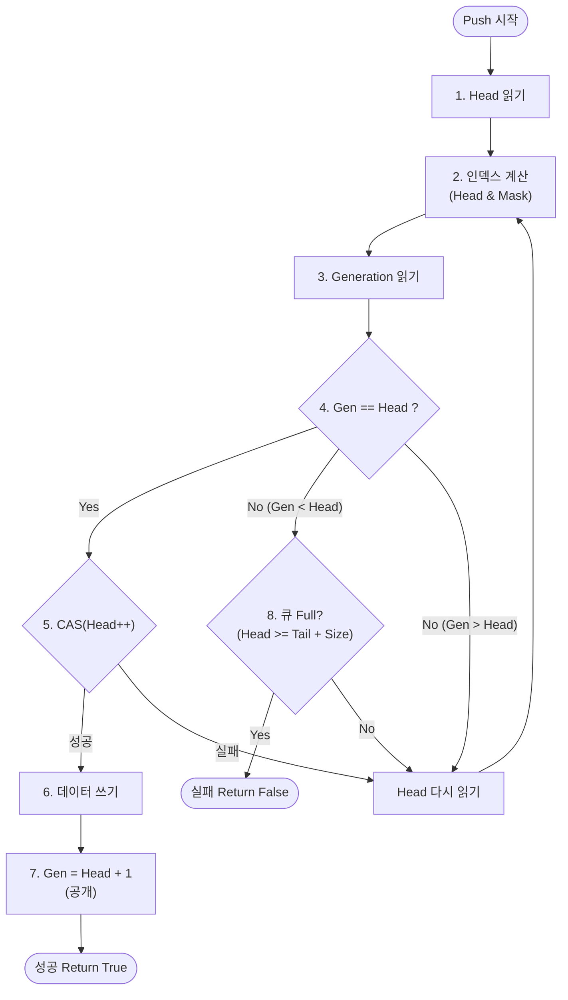
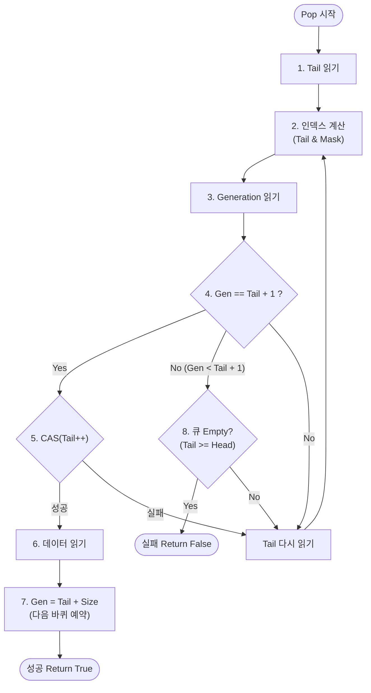

# MPMCQueue 구현 분석

## 개요
`MPMCQueue`는 C++17 표준을 준수하는 Lock-Free Multi-Producer Multi-Consumer 큐입니다. Dmitry Vyukov의 Bounded MPMC Queue 알고리즘을 기반으로 하며, 성능 최적화를 위해 캐시 라인 패딩과 메모리 정렬이 적용되어 있습니다.

## 핵심 구조

### 1. 링 버퍼 (Ring Buffer)
- 고정 크기 배열 `m_buffer`를 사용하는 원형 큐 구조입니다.
- 큐의 크기(`Size`)는 반드시 2의 제곱이어야 합니다. 이는 모듈러 연산 대신 비트 AND 연산(`& (Size - 1)`)을 사용하여 인덱스를 빠르게 계산하기 위함입니다.

### 2. 슬롯 (Slot)
```cpp
struct alignas(lfq::CACHE_LINE_SIZE) Slot
{
    std::atomic<size_t> _generation;
    T _data;
};
```
- **Generation Counter**: ABA 문제를 해결하고 슬롯의 상태(비어있음/데이터 있음)를 관리합니다.
- **Padding**: `alignas(lfq::CACHE_LINE_SIZE)`를 사용하여 각 슬롯이 독립적인 캐시 라인을 점유하도록 합니다. 이는 인접한 슬롯에 접근하는 스레드 간의 **거짓 공유(False Sharing)**를 방지하여 성능을 극대화합니다.

### 3. Head와 Tail
```cpp
alignas(lfq::CACHE_LINE_SIZE) std::atomic<size_t> m_head;
alignas(lfq::CACHE_LINE_SIZE) std::atomic<size_t> m_tail;
```
- `m_head`: 다음 Push 위치를 가리킵니다.
- `m_tail`: 다음 Pop 위치를 가리킵니다.
- 두 변수 모두 독립적인 캐시 라인에 위치하도록 패딩 처리되어 있습니다.

## 알고리즘 상세

### Push 동작
1. `m_head`를 로드하여 현재 넣을 위치를 확인합니다.
2. 해당 위치의 `Slot`의 `_generation`을 확인합니다.
   - `_generation == _head`: 슬롯이 비어있고 내 차례입니다. CAS로 `m_head`를 증가시켜 슬롯을 예약합니다. 성공 시 데이터를 쓰고 `_generation`을 `_head + 1`로 업데이트하여 Pop이 가능함을 알립니다.
   - `_generation < _head`: 큐가 가득 찼거나 다른 스레드가 Pop을 완료하지 않았습니다. 큐가 꽉 찼는지 확인하고 재시도합니다.
   - `_generation > _head`: 다른 스레드가 이미 이 슬롯을 선점했습니다. 재시도합니다.



### Pop 동작
1. `m_tail`을 로드하여 현재 꺼낼 위치를 확인합니다.
2. 해당 위치의 `Slot`의 `_generation`을 확인합니다.
   - `_generation == _tail + 1`: 데이터가 준비되었습니다. CAS로 `m_tail`을 증가시켜 슬롯을 예약합니다. 성공 시 데이터를 읽고 `_generation`을 `_tail + Size`로 업데이트하여 다음 바퀴의 Push가 가능함을 알립니다.
   - `_generation < _tail + 1`: 큐가 비었거나 Push가 완료되지 않았습니다. 큐가 비었는지 확인하고 재시도합니다.
   - 그 외: 비정상 상황이거나 경합 상태이므로 재시도합니다.



## 메모리 모델 (Memory Ordering)
- **Relaxed**: `m_head`, `m_tail`의 단순 로드/CAS 실패 시 사용. 성능을 위해 불필요한 동기화를 피합니다.
- **Acquire**: `_generation`을 읽을 때 사용. 데이터를 읽기 전에 이전의 모든 메모리 쓰기가 완료되었음을 보장합니다.
- **Release**: `_generation`을 쓸 때 사용. 데이터를 쓴 후(Push) 또는 읽은 후(Pop)에만 generation이 업데이트되도록 보장합니다.

## 최적화 포인트
1. **False Sharing 방지**: `Slot`, `m_head`, `m_tail`에 패딩을 적용하여 캐시 경합을 최소화했습니다. 벤치마크 결과 Mutex 방식 대비 약 50% 이상의 성능 향상을 보였습니다.
2. **비트 연산**: 2의 제곱 크기를 강제하여 나머지 연산(`%`) 대신 비트 연산(`&`)을 사용, CPU 사이클을 절약합니다.
3. **Lock-Free**: Mutex를 사용하지 않아 컨텍스트 스위칭 비용이 없고, 높은 동시성을 제공합니다.
